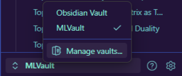
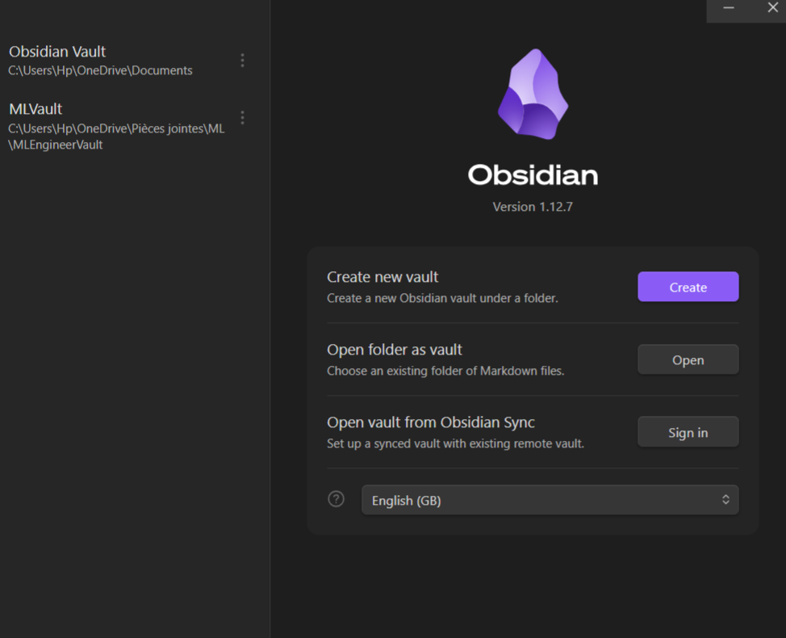

# *Full Guide to open the notes on Obsidien*
---
## How to install Obsidien:
---
* ### First, vist their website :  [Obsidien install](https://obsidian.md/download)

> Available on Mac, Linux and Windows
>>
> Available on iOS and Android

* ### To get familair with obsidien, I recommand to watch these video:

1.  [From Notion to Obsidien](https://youtu.be/O7vGsBghWfc?si=lGEFXzJhEBJgMxLv)
2. [Obsidien in 15 min!](https://youtu.be/z4AbijUCoKU?si=pXdIzdg46-AxI2bA)

---
## Import filles into Obsidien

---

1. #### Click on the Obsidien Vault you created:

2. #### Once you click, you will find  *_Manage vaults_* :

3. #### You will find where to import the filles :

