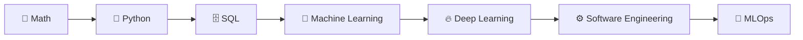

# 🧠 Zero to ML Engineer

> A structured, self-paced roadmap for going from complete beginner to job-ready Machine Learning Engineer —  
> built in public, one topic at a time.

---

## 👋 What is this?

This is my personal ML Engineer roadmap — a living repository where I document everything I learn on the journey from **zero** to becoming a **Machine Learning Engineer**.

Every folder is a phase. Every file is a topic. Every resource is something I've personally vetted.

If you're on a similar path, feel free to fork it and make it your own.

---

## 🗺️ Roadmap Overview

---

## ✅ Progress Tracker

| Phase | Topics | Status |
|-------|--------|--------|
| [📐 01 - Math](./01-Math/README.md) | Linear Algebra, Statistics, Calculus | 🔄 In Progress |
| 🐍 02 - Python | Data Structures, OOP, NumPy, Pandas | ⬜ Not Started |
| 🗄️ 03 - SQL | Queries, Joins, Aggregations | ⬜ Not Started |
| 🧠 04 - Machine Learning | Regression, Trees, Clustering, Evaluation | ⬜ Not Started |
| 🔥 05 - Deep Learning | Neural Networks, CNNs, RNNs, Transformers | ⬜ Not Started |
| ⚙️ 06 - Software Engineering | DSA, System Design, APIs | ⬜ Not Started |
| 🚀 07 - MLOps | Cloud, Docker, Git & CI/CD | ⬜ Not Started |

---

## 🧱 How Each Topic is Documented

Every topic folder contains two files:

- **`notes.md`** — my personal summary, key concepts, and understanding written in Obsidian
- **`resources.md`** — curated list of courses, books, and free resources

---

## 🛠️ Tools & Stack

| Purpose | Tool |
|---------|------|
| Note-taking | Obsidian |
| Language | Python |
| ML Libraries | Scikit-learn, PyTorch |
| Data | NumPy, Pandas, Matplotlib |
| Version Control | Git & GitHub |

---

*Built with curiosity, coffee, and a stubborn refusal to stay a beginner.*

⭐ **Star this repo if it helps you too**

